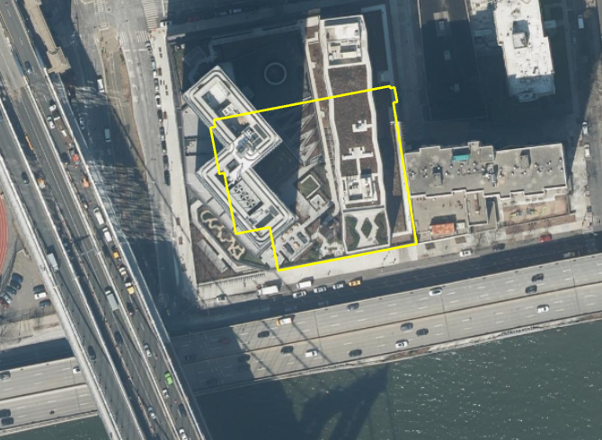

# Building Historic
Geometry Type: polygon  

### Table of Contents  &nbsp;&nbsp;&nbsp;&nbsp;&nbsp;&nbsp;&nbsp;&nbsp;&nbsp;[**1. Identification**](#1-identification) &nbsp;&nbsp;&nbsp;&nbsp;&nbsp;&nbsp;&nbsp;&nbsp;&nbsp;[**2. Data Quality and Specifications**](#2-data-quality-and-specifications) &nbsp;&nbsp;&nbsp;&nbsp;&nbsp;&nbsp;&nbsp;&nbsp;&nbsp;[**3. Attribute Information**](#3-attribute-information)  
## 1. Identification
---------------------------------------------
|     |     |
| --- | --- |
**Purpose** |The New York City Office of Technology and Innovation GIS unit maintains and distributes an accurate 'basemap' for New York City. The basemap provides the foundation for almost all other geospatial data in New York City.
**Description** |Historic Building footprints represent buildings that have been demolished or significantly altered. As with the building footprint features, historic footprints represent the full perimeter outline of each building as viewed from directly above. Additional attribute information maintained for each feature includes: Building Identification Number (BIN); Borough, Block, and Lot information; ground elevation at building base; roof height above ground elevation; construction year; demolition year; and feature type.
**Source(s)** |Annually captured aerial imagery, Research of Department of Buildings records and other NYC records, EagleView Oblique imagery, Cyclomedia panoramic photographs.
**Publication Dates** |**Last Update**: Weekly **Metadata**: 01/13/2025 **Update Frequency**: Features are updated daily by OTI staff and regularly published on [NYC Open Data](https://opendata.cityofnewyork.us/) and [NYCMaps](https://nycmaps-nyc.hub.arcgis.com/). 
**Available Formats** |Individual shapefile on the [NYC Open Data Portal](https://data.cityofnewyork.us/Housing-Development/Building-Footprint-Historical/ipkp-snf6/about_data)   Multiple formats from [NYCMapHub](https://nycmaps-nyc.hub.arcgis.com/datasets/nyc::building-historic/about)
**Use Limitations** |Open Data policies and restrictions apply. See [Terms of Use](http://www.nyc.gov/html/data/terms.html)
**Access Rights** |Public
**Links** |https://data.cityofnewyork.us/Housing-Development/Building-Footprint-Historical/ipkp-snf6/about_data  https://nycmaps-nyc.hub.arcgis.com/datasets/nyc::building-historic/about
**Tags** |Buildings, Building footprint, BIN, Structure
## 2. Data Quality and Specifications
---------------------------------------------
|     |     |
| --- | --- |
**Horizontal Coordinate System** |New York State Plane Coordinates, Long Island East Zone, NAD83, US foot ([epsg:2263](https://spatialreference.org/ref/epsg/2263/)); Vertical Datum NAVD 1988
**Resolution** |NA
**Spatial Coverage** |New York City, NY
**Positional Accuracy** |Estimated positional accuracy for photogrammetrically updated features (those with GEOM_SOURCE = Photogrammetric) is +/- 2 feet and meets ASPRS Class 1 horizontal mapping standards and ASPRS vertical Class 2 accuracy specifications.  The mapping standards deal with Root Mean Square (RMS) calculations that states if a random number of clearly identifiable surveyed ground control points throughout the project were compared to the mapped features, the RMS of the points would not exceed 2'. In layman's terms,  95% of the data is accurate to +/- 2'. Features with GEOM_SOURCE = Other (Manual) are captured by heads-up digitizing using the most current orthophotography available. These will be somewhat less accurate than the photogrammetrically updated features. 
**Features Captured** |All buildings >400 sq. feet and taller than 12 feet.  We also include other buildings with Building Identification Numbers (BINs) maintained by city agencies. 
**Features Excluded** |Interior divisions. Temporary trailers or tents.   Movable jet bridges for access to aircraft. Awnings, scaffolds, or sidewalk sheds. Small tool or storage sheds in backyards which have no visible car access. 
**Capture and Update Notes** |We move building footprints to building_historic when they are demolished or significantly altered. See [building footprints](.Metadata/Metadata_BuildingFootprints.md) for original capture and update notes.
