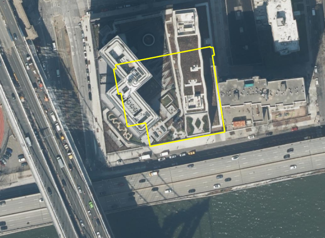
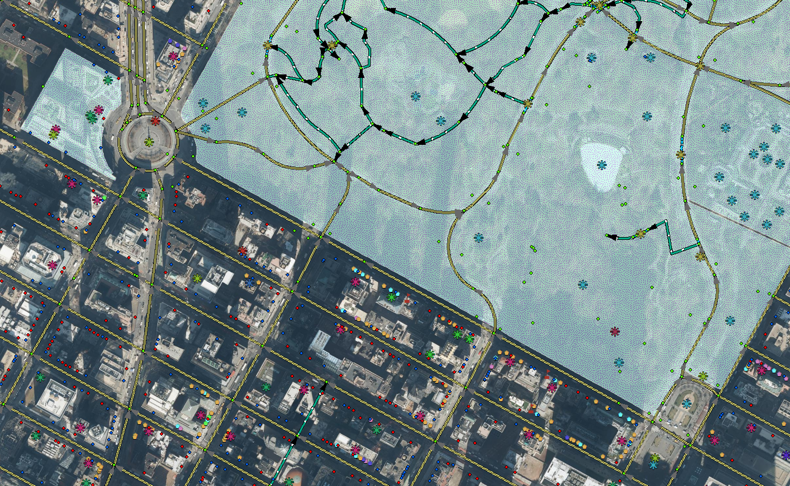

# NYC GIS Metadata
-------------

This document lists metadata sources for data updated and maintained by the NYC Office of Technology and Innovation (OTI).

| Data/Layer Name | Description | Preview |
| ---|---|---|
[3-D Building Model](https://github.com/CityOfNewYork/nyc-geo-metadata/blob/main/Metadata/Metadata_3DBuildingModel.md) | 3-D Building Models representing every NYC building present in the 2014 aerial survey. Models are based on a hybrid of the CItyGML Level of Detail (LOD) 1 (simple/prismatic buildings with flat roof detail) and LOD 2 (includes roof structure details) with approximately 100 iconic buildings modeled to LOD 2.  Highlights of the model include the differentiation of building components including roof, facades, and ground plane.  | 
[Address Point](https://github.com/CityOfNewYork/nyc-geo-metadata/blob/main/Metadata/Metadata_AddressPoint.md) | Address points are part of the Citywide Street Centerline (CSCL) database. The data represent visually identifiable and Borough President assigned addresses within NYC.  Placement of the address points are approximately five feet within the respective building footprint along  street front the address is assigned.  | 
[Aerial Imagery](https://github.com/CityOfNewYork/nyc-geo-metadata/blob/main/Metadata/Metadata_AerialImagery.md) | Raster file of vertical aerial imagery covering New York City. Imagery is captured every 2 years during spring/summer months and corrected through computer processes to remove distortions caused by elevation changes and camera angles. | 
[Building Footprints](./Metadata/Metadata_BuildingFootprints.md) | Building footprints represent the perimeter outline of each building. Divisions between adjoining buildings are determined by tax lot divisions.  | 
[Building Historic](./Metadata/Metadata_BuildingHistoric.md) | Historic Building footprints represent buildings that have been demolished or significantly altered. As with the building footprints features, they represent the full perimeter outline of each building as viewed from directly above. | 
[Business Improvement Districts](https://github.com/CityOfNewYork/nyc-geo-metadata/blob/main/Metadata/Metadata_BIDs.md) | Polygons representing the extent of Business Improvement Districts (BIDs). A BID is a public/private partnership in which property and business owners elect to make a collective contribution to the maintenance, development, and promotion of their commercial district.  | 
[Contours](https://github.com/CityOfNewYork/nyc-geo-metadata/blob/main/Metadata/Metadata_Contours.md) | Continuous lines representing points of equal elevation  at 2-ft intervals. | 
[CSCL](./Metadata/CSCL.md) | Citywide CenterLine (CSCL) file geodatabase. | 
[CSCL Pub](./Metadata/CSCL_Pub.md) | Published Citywide CenterLine (CSCL) file geodatabase. | 
[LiDAR](./Metadata/Metadata_LiDAR_Summary.md) | Raster files and point clouds from 2010 and 2017 LiDAR capture covering New York City. The 2010 LiDAR includes one hydro-flattened digital elevation model (DEM). The 2017 LiDAR includes classed and unclassed point clouds in laz format, bare earth DEM, hydroflattened DEM, hydro-enforced DEM (filled and unfilled), highest hit, intensity imagery, 8-class land cover, and tree canopy change (2010-2017). | 
[Planimetrics](https://github.com/CityOfNewYork/nyc-planimetrics/blob/main/Capture_Rules.md) | Planimetric mapping is the capture of geographic features from aerial survey that are traditionally mapped in two dimensions. NYC OTI first developed a planimetric database in 2000. Today, the database includes features for [Boardwalk](https://github.com/CityOfNewYork/nyc-planimetrics/blob/main/Capture_Rules.md#boardwalk), [Cooling Towers](https://github.com/CityOfNewYork/nyc-planimetrics/blob/main/Capture_Rules.md#cooling-towers), [Curb](https://github.com/CityOfNewYork/nyc-planimetrics/blob/main/Capture_Rules.md#curb), [Elevation](https://github.com/CityOfNewYork/nyc-planimetrics/blob/main/Capture_Rules.md#elevation), [Hydro Structure](https://github.com/CityOfNewYork/nyc-planimetrics/blob/main/Capture_Rules.md#hydro-structure), [Hydrography](https://github.com/CityOfNewYork/nyc-planimetrics/blob/main/Capture_Rules.md#hydrography), [Median](https://github.com/CityOfNewYork/nyc-planimetrics/blob/main/Capture_Rules.md#median), [Misc Struct Poly](https://github.com/CityOfNewYork/nyc-planimetrics/blob/main/Capture_Rules.md#misc-struct-poly), [Open Space](https://github.com/CityOfNewYork/nyc-planimetrics/blob/main/Capture_Rules.md#open-space), [Park](https://github.com/CityOfNewYork/nyc-planimetrics/blob/main/Capture_Rules.md#park), [Parking Lot](https://github.com/CityOfNewYork/nyc-planimetrics/blob/main/Capture_Rules.md#parking-lot), [Pavement Edge](https://github.com/CityOfNewYork/nyc-planimetrics/blob/main/Capture_Rules.md#pavement-edge), [Plaza](https://github.com/CityOfNewYork/nyc-planimetrics/blob/main/Capture_Rules.md#plaza), [Railroad](https://github.com/CityOfNewYork/nyc-planimetrics/blob/main/Capture_Rules.md#railroad), [Railroad Structure](https://github.com/CityOfNewYork/nyc-planimetrics/blob/main/Capture_Rules.md#railroad-structure), [Retaining Wall](https://github.com/CityOfNewYork/nyc-planimetrics/blob/main/Capture_Rules.md#retaining-wall), [Roadbed](https://github.com/CityOfNewYork/nyc-planimetrics/blob/main/Capture_Rules.md#roadbed), [Shoreline](https://github.com/CityOfNewYork/nyc-planimetrics/blob/main/Capture_Rules.md#shoreline), [Sidewalk](https://github.com/CityOfNewYork/nyc-planimetrics/blob/main/Capture_Rules.md#sidewalk), [Sidewalk Centerline](https://github.com/CityOfNewYork/nyc-planimetrics/blob/main/Capture_Rules.md#sidewalk-centerline), [Swimming Pool](https://github.com/CityOfNewYork/nyc-planimetrics/blob/main/Capture_Rules.md#swimming-pool), [Transport Structure](https://github.com/CityOfNewYork/nyc-planimetrics/blob/main/Capture_Rules.md#transport-structure), and [Under Construction](https://github.com/CityOfNewYork/nyc-planimetrics/blob/main/Capture_Rules.md#under-construction). | 
[Points Of Interest](https://github.com/CityOfNewYork/nyc-geo-metadata/blob/main/Metadata/Metadata_PointsOfInterest.md) | Point of Interest (aka Common Place) are point representations of locations that can be referred to by name and may or may not have an address. The data is a compilation of a variety of agency data and is a component of the CSCL database. | 
[Shoreline (Tidally Coordinated)](https://github.com/CityOfNewYork/nyc-geo-metadata/blob/main/Metadata/Metadata_TidalShoreline.md) | A dataset representing the shorelines of tidally influenced areas of New York City. This dataset derived from the 2017 Light Detection and Ranging (LiDAR) data capture. In most areas LiDAR was captured during low tide (defined here as a range between Mean Lower Low Water (MLLW) and MLLW + 30% of the mean tide range). All bathymetric LiDAR and most near-infrared (NIR) LiDAR was captured during low tide. Flights flown over NIR LiDAR shoreline areas that are largely made up of sea walls and riprap were not flown during low tide. See dataset attributes for which areas are tidally-coordinated. Tidal gauges used to determine low tide: Kings Point, Bergen West, Sandy Hook, and The Battery. |
[Subway Stations](https://github.com/CityOfNewYork/nyc-geo-metadata/blob/main/Metadata/Metadata_SubwayStations.md) | Point representing approximate location of NYC Transit Subway Stations.  | 
[Subway Lines](https://github.com/CityOfNewYork/nyc-geo-metadata/blob/main/Metadata/Metadata_SubwayLines.md) | Line representing NYC Transit Subway Lines. Lines are optimized for cartographic representation in web applications.  | 
[Street Centerline](https://github.com/CityOfNewYork/nyc-geo-metadata/blob/main/Metadata/Metadata_StreetCenterline.md) | Street Centerline is a single line representation of New York City streets representing each separate carriageway (e.g., two lines represent the divided roadway of Park Avenue South). The centerlines contain address ranges, traffic directions, road and segment types. Street Centerline is part of the Citywide Street Centerline (CSCL)  database that supports multiple agencies, including the emergency 911 dispatching systems.  | 
[WiFi Hotspots](https://github.com/CityOfNewYork/nyc-geo-metadata/blob/main/Metadata/Metadata_WiFiHotspots.md) | Public Wi-Fi Hotspot locations throughout the 5 boroughs including LinkNYC-Citybridge. | 

